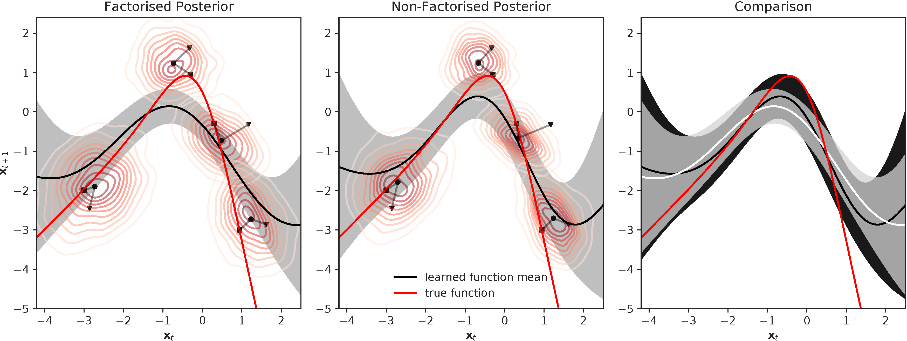

# GPt
A library for Recurrent Gaussian Process Models based on GPflow and TensorFlow.

It implements all the inference methods contained in this paper: 

A.D. Ialongo, M. van der Wilk, J. Hensman, C.E. Rasmussen. [Overcoming Mean-Field Approximations in Recurrent Gaussian Process Models](https://arxiv.org/pdf/1906.05828.pdf). In *ICML*, 2019. 

### Setup
Install TensorFlow.

Clone GPflow from https://github.com/ialong/GPflow. Select the `custom_multioutput` branch.

Follow the instructions to install GPflow.

Clone GPt.

Example code and models are in the `examples/` directory.

### Running tests
`python -m unittest discover`

## Applications and Support
We encourage the use of this code for applications (both in the private and public sectors).

Please tell us about your project by sending an email to the address below. Generally, for support feel free to email or open an issue on GitHub. 

`alex` `.` `ialongo` `at` `gmail`
